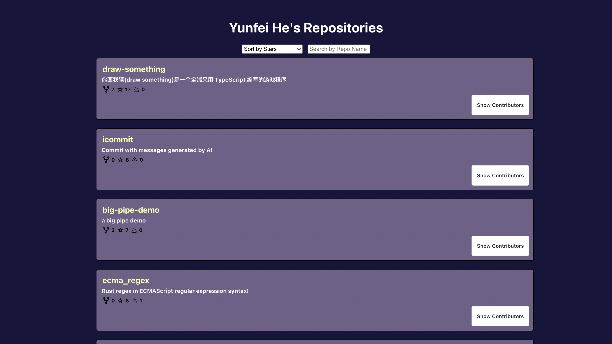

# GitHub Search Project

## Overview

This project is created for learning purposes. It serves as a basic example of how to interact with the GitHub API using a React application. The implementation is kept simple to help beginners understand the core concepts without being overwhelmed by complexity.

## Features

- Search for GitHub repositories by name.
- Search for GitHub users by username.
- View repository details such as stars, forks, and issues.
- View user details including repositories & contributors.

a
## Getting Started

### Prerequisites

Make sure you have the following installed on your system:

- [Node.js](https://nodejs.org/) (v14 or higher)
- [npm](https://www.npmjs.com/) or [yarn](https://yarnpkg.com/)

### Installation

1. Clone the repository:

    ```sh
    git clone https://github.com/YOUR-USERNAME/github-search.git
    cd github-search
    ```

2. Install the dependencies:

    ```sh
    npm install
    # or
    yarn install
    ```

### Configuration

Create a `.env` file in the root of the project and add your GitHub API token:

```plaintext
REACT_APP_GITHUB_API_TOKEN=your_github_api_token
```

### Configuration

Create a `.env` file in the root of the project and add your GitHub API token:

```plaintext
REACT_APP_GITHUB_API_TOKEN=your_github_api_token
```

You can generate a GitHub API token [here](https://github.com/settings/tokens).

### Running the Application
Start the development server:

```
npm start

 # or
 
yarn start

```

The application will be available at http://localhost:3000.

### Usage
- Enter a repository name or username in the search bar and press enter.
- Click on a repository or user from the search results to view more details.

### Screen Shots




 
### Built With
- React - A JavaScript library for building user interfaces.
- TypeScript - A typed superset of JavaScript.
- GitHub API - The REST API for GitHub.
 
### Extending the Project

Feel free to extend the functionality of this project and add more features. Some ideas for enhancements include:

- **Pagination**: Add support for paginating through search results.
- **User Profiles**: Enhance the user search functionality to display more detailed user profiles.
- **Advanced Search**: Implement advanced search options for repositories and users.
- **Styling**: Improve the UI/UX with better styling and responsive design.
- **Error Handling**: Add more robust error handling and loading states.

### Contributing
Contributions are welcome! Please fork the repository and create a pull request.

- Fork the repository.
- Create a new branch: git checkout -b feature/your-feature-name.
- Make your changes and commit them: git commit -m 'Add some feature'.
- Push to the branch: git push origin feature/your-feature-name.
- Create a pull request.


### Acknowledgments
- GitHub for providing the API.
- React for the UI library.
